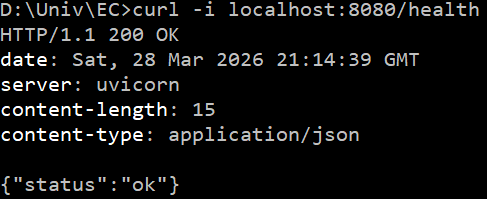
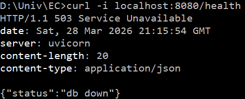
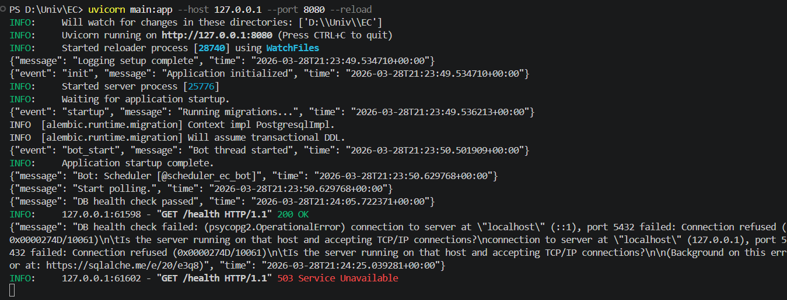
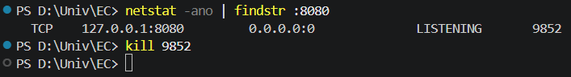
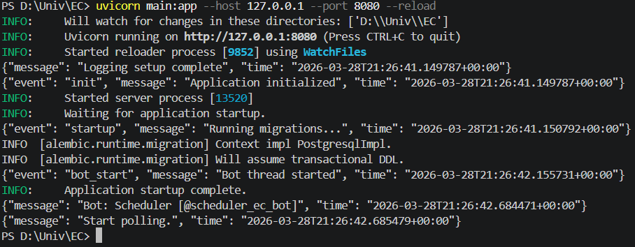

# Telegram Bot для розкладу для учня

REST API на Python (FastAPI) для перегляду шкільного розкладу через Telegram-бота.  

---

## Налаштування

### Змінні оточення

| Змінна        | Обов'язкова | Опис                                           | Приклад                                      |
|---------------|-------------|-----------------------------------------------|---------------------------------------------|
| `DB_HOST`     | Так         | Хост PostgreSQL                                | `localhost`                                 |
| `DB_PORT`     | Так         | Порт PostgreSQL                                | `5432`                                      |
| `DB_NAME`     | Так         | Назва бази даних                               | `schedule_db`                               |
| `DB_USER`     | Так         | Користувач бази даних                          | `postgres`                                  |
| `DB_PASSWORD` | Так         | Пароль користувача                             | `12345`                                  |
| `BOT_TOKEN`   | Так         | Токен Telegram-бота                            | `8650353522:AAGPFqoZaZow-XgnOd5b69mYXaWb1cGHb3I`                      |
| `ADDR`        | Ні          | Адреса, на якій слухає FastAPI (за замовч.)  | `:8000`                                     |

---

## Запуск
```
pip install -r requirements.txt
alembic revision --autogenerate -m "init"
alembic upgrade head
python seed.py
uvicorn app.main:app --reload
```

---

## Підтвердження Health Check
### 200 OK — БД підключена
```
curl -i localhost:8080/health
```


### 503 Service Unavailable — БД зупинена
```
Stop-Service -Name postgresql-x64-16 -Force
curl -i localhost:8080/health
```


### JSON-логи під час запуску застосунку
```
INFO:     Will watch for changes in these directories: ['D:\\Univ\\EC']
INFO:     Uvicorn running on http://127.0.0.1:8080 (Press CTRL+C to quit)
INFO:     Started reloader process [28740] using WatchFiles
{"message": "Logging setup complete", "time": "2026-03-28T21:23:49.534710+00:00"}
{"event": "init", "message": "Application initialized", "time": "2026-03-28T21:23:49.534710+00:00"}
INFO:     Started server process [25776]
INFO:     Waiting for application startup.
{"event": "startup", "message": "Running migrations...", "time": "2026-03-28T21:23:49.536213+00:00"}
INFO  [alembic.runtime.migration] Context impl PostgresqlImpl.
INFO  [alembic.runtime.migration] Will assume transactional DDL.
{"event": "bot_start", "message": "Bot thread started", "time": "2026-03-28T21:23:50.501909+00:00"}
INFO:     Application startup complete.
{"message": "Bot: Scheduler [@scheduler_ec_bot]", "time": "2026-03-28T21:23:50.629768+00:00"}
{"message": "Start polling.", "time": "2026-03-28T21:23:50.629768+00:00"}
{"message": "DB health check passed", "time": "2026-03-28T21:24:05.722371+00:00"}
INFO:     127.0.0.1:61598 - "GET /health HTTP/1.1" 200 OK
{"message": "DB health check failed: (psycopg2.OperationalError) connection to server at \"localhost\" (::1), port 5432 failed: Connection refused (0x0000274D/10061)\n\tIs the server running on that host and accepting TCP/IP connections?\nconnection to server at \"localhost\" (127.0.0.1), port 5432 failed: Connection refused (0x0000274D/10061)\n\tIs the server running on that host and accepting TCP/IP connections?\n\n(Background on this error at: https://sqlalche.me/e/20/e3q8)", "time": "2026-03-28T21:24:25.039281+00:00"}
INFO:     127.0.0.1:61602 - "GET /health HTTP/1.1" 503 Service Unavailable
```


### Підтвердження Graceful Shutdown

