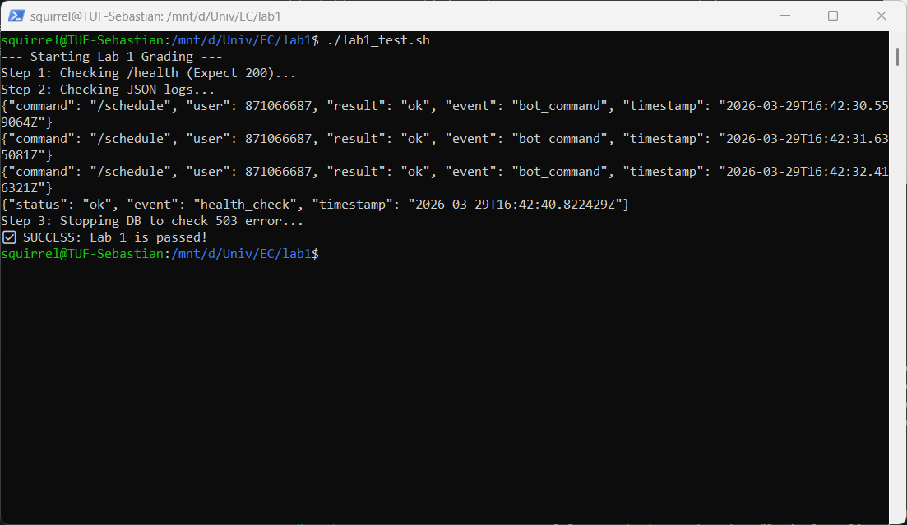

# Telegram Bot для розкладу для учня

REST API на Python (FastAPI) для перегляду шкільного розкладу через Telegram-бота.  

---

## Запуск
```
pip install -r requirements.txt
docker compose up --build
```

---

## Підтвердження Health Check
```
squirrel@TUF-Sebastian:/mnt/d/Univ/EC/lab1$ ./lab1_test.sh
--- Starting Lab 1 Grading ---
Step 1: Checking /health (Expect 200)...
Step 2: Checking JSON logs...
{"command": "/schedule", "user": 871066687, "result": "ok", "event": "bot_command", "timestamp": "2026-03-29T16:42:30.559064Z"}
{"command": "/schedule", "user": 871066687, "result": "ok", "event": "bot_command", "timestamp": "2026-03-29T16:42:31.635081Z"}
{"command": "/schedule", "user": 871066687, "result": "ok", "event": "bot_command", "timestamp": "2026-03-29T16:42:32.416321Z"}
{"status": "ok", "event": "health_check", "timestamp": "2026-03-29T16:42:40.822429Z"}
Step 3: Stopping DB to check 503 error...
✅ SUCCESS: Lab 1 is passed!
squirrel@TUF-Sebastian:/mnt/d/Univ/EC/lab1$
```


---

### JSON-логи під час запуску застосунку
```
[+] up 2/2
 ✔ Image lab1-app Built                                                                                                                         1.9s
 ✔ Container app  Recreated                                                                                                                     0.1s
Attaching to app, db
Container db Waiting 
db  |
db  | PostgreSQL Database directory appears to contain a database; Skipping initialization
db  |                                                                                                                                               
db  | 2026-03-29 16:41:42.626 UTC [1] LOG:  starting PostgreSQL 16.13 on x86_64-pc-linux-musl, compiled by gcc (Alpine 15.2.0) 15.2.0, 64-bit       
db  | 2026-03-29 16:41:42.626 UTC [1] LOG:  listening on IPv4 address "0.0.0.0", port 5432
db  | 2026-03-29 16:41:42.626 UTC [1] LOG:  listening on IPv6 address "::", port 5432                                                               
db  | 2026-03-29 16:41:42.631 UTC [1] LOG:  listening on Unix socket "/var/run/postgresql/.s.PGSQL.5432"                                            
db  | 2026-03-29 16:41:42.639 UTC [29] LOG:  database system was shut down at 2026-03-29 16:39:59 UTC                                               
db  | 2026-03-29 16:41:42.645 UTC [1] LOG:  database system is ready to accept connections                                                          
Container db Healthy 
app  | INFO:     Started server process [1]
app  | INFO:     Waiting for application startup.
app  | INFO:     Application startup complete.                                                                                                      
app  | INFO:     Uvicorn running on http://0.0.0.0:8080 (Press CTRL+C to quit)                                                                      
app  | Bot: Scheduler [@scheduler_ec_bot]                                                                                                           
app  | Start polling.
app  | {"command": "/start", "user": 871066687, "event": "bot_command", "timestamp": "2026-03-29T16:42:15.125485Z"}                                 
app  | {"command": "/schedule", "user": 871066687, "result": "ok", "event": "bot_command", "timestamp": "2026-03-29T16:42:24.458169Z"}
app  | {"command": "/schedule", "user": 871066687, "result": "ok", "event": "bot_command", "timestamp": "2026-03-29T16:42:30.559064Z"}
app  | {"command": "/schedule", "user": 871066687, "result": "ok", "event": "bot_command", "timestamp": "2026-03-29T16:42:31.635081Z"}
app  | {"command": "/schedule", "user": 871066687, "result": "ok", "event": "bot_command", "timestamp": "2026-03-29T16:42:32.416321Z"}
app  | {"status": "ok", "event": "health_check", "timestamp": "2026-03-29T16:42:40.822429Z"}
app  | INFO:     172.18.0.1:47294 - "GET /health HTTP/1.1" 200 OK
db   | 2026-03-29 16:42:41.016 UTC [1] LOG:  received fast shutdown request                                                                         
db   | 2026-03-29 16:42:41.019 UTC [1] LOG:  aborting any active transactions
db   | 2026-03-29 16:42:41.019 UTC [41] FATAL:  terminating connection due to administrator command                                                 
db   | 2026-03-29 16:42:41.021 UTC [1] LOG:  background worker "logical replication launcher" (PID 32) exited with exit code 1
db   | 2026-03-29 16:42:41.021 UTC [27] LOG:  shutting down                                                                                         
db   | 2026-03-29 16:42:41.024 UTC [27] LOG:  checkpoint starting: shutdown immediate                                                               
db   | 2026-03-29 16:42:41.039 UTC [27] LOG:  checkpoint complete: wrote 3 buffers (0.0%); 0 WAL file(s) added, 0 removed, 0 recycled; write=0.006 s, sync=0.003 s, total=0.018 s; sync files=2, longest=0.002 s, average=0.002 s; distance=0 kB, estimate=0 kB; lsn=0/1987F80, redo lsn=0/1987F80      
db   | 2026-03-29 16:42:41.045 UTC [1] LOG:  database system is shut down
db exited with code 0
app  | {"status": "error", "detail": "Database not reachable", "event": "health_check", "timestamp": "2026-03-29T16:42:44.392977Z"}
app  | INFO:     172.18.0.1:46076 - "GET /health HTTP/1.1" 503 Service Unavailable
```