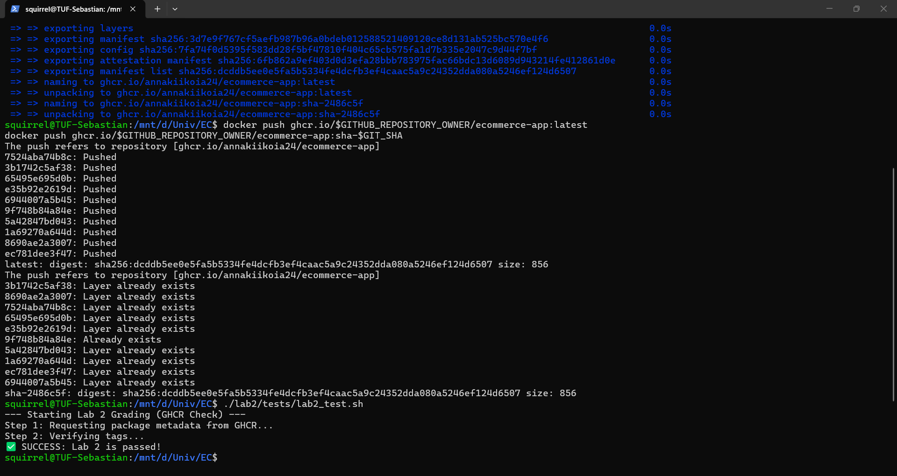

# Telegram Bot для розкладу для учня

REST API на Python (FastAPI) для перегляду шкільного розкладу через Telegram-бота.  

---

## Логи виконання
```
./lab2/tests/lab2_test.sh
--- Starting Lab 2 Grading (GHCR Check) ---
Step 1: Requesting package metadata from GHCR...
Step 2: Verifying tags...
✅ SUCCESS: Lab 2 is passed!
```
