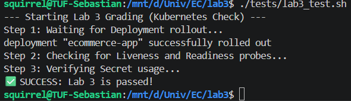

# Telegram Bot для розкладу для учня

REST API на Python (FastAPI) для перегляду шкільного розкладу через Telegram-бота.  

---
## Запуск
```
cd lab3
docker build -t ecommerce-app:lab3 .
kind load docker-image ecommerce-app:lab3 --name lab3-cluster
cd /mnt/d/Univ/EC
kubectl apply -f k8s/
kubectl rollout status deployment/ecommerce-app
kubectl port-forward svc/ecommerce-api 8000:8000
```
## Логи виконання
```
squirrel@TUF-Sebastian:/mnt/d/Univ/EC/lab3$ ./tests/lab3_test.sh
--- Starting Lab 3 Grading (Kubernetes Check) ---
Step 1: Waiting for Deployment rollout...
deployment "ecommerce-app" successfully rolled out
Step 2: Checking for Liveness and Readiness probes...
Step 3: Verifying Secret usage...
✅ SUCCESS: Lab 3 is passed!
squirrel@TUF-Sebastian:/mnt/d/Univ/EC/lab3$
```
